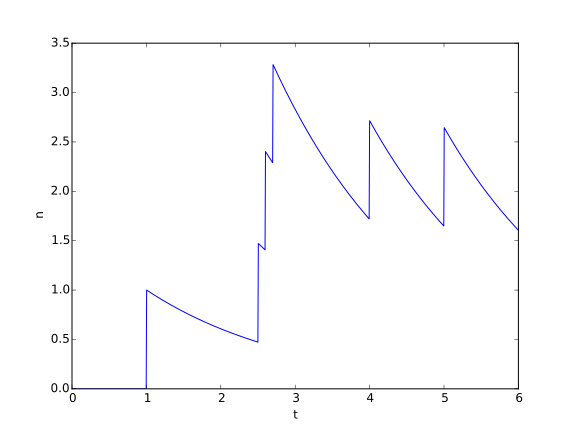

C Library
=========

This section is aimed at developers that want to understand the
architecture of the library, in order to extend it.

When trying to understand some code I like to start with the data
structures that make the inputs and the outputs of the
code. :cpp:class:`CrawledPage` is the input of Aduana and the best
place to start.

CrawledPage
-----------

Data structures
~~~~~~~~~~~~~~~

.. doxygenstruct:: CrawledPage
   :members:

The utility of :cpp:member:`CrawledPage::url` and
:cpp:member:`CrawledPage::links` are quite obvious, the others need an explanation:

- :cpp:member:`CrawledPage::time`: this is used to compute how often a
  page changes and also it would be useful for a revisiting schedule
  to know how much time has passed since the page was crawled.

- :cpp:member:`CrawledPage::score`: one of the objectives of Aduana is
  to guide the crawl to interesting pages. Since the definition of
  interesting is application dependent each crawler can give a measure
  of how interesting they found the page to be. How this number will
  be exactly used depends on which scorer are we going to use. This
  field is not mandatory and actually Aduana can be configured to
  ignore it.

- :cpp:member:`CrawledPage::content_hash`: in order to detect if a
  page has changed this hash is compared with the hash previously
  stored for this same page. If the hash has changed we consider that
  the page has changed. Notice that the content hash is also
  application dependent: some applications may consider that the page
  has changed only if there are new links, others will consider a page
  has changed if the body text, after stripping HTML tags, has
  changed, etc... This field can be ignored too, in which case the
  pages will be considered as unchanging.

C is not known for its powerful and flexible data structures. In order
to store a variable number of links per crawled page we implement this
resizable array. Each time we run out of allocated memory the size of
the reserved memory is doubled.

.. doxygenstruct:: PageLinks
   :members:

Initially we reserve this number of links

.. doxygendefine:: PAGE_LINKS_MIN_LINKS

Finally, each link not only carries an URL, but also a score. The
score gives an idea of how good the (maybe uncrawled) link is,
according to the web crawler. Think of the link score as an
approximation to :cpp:member:`CrawledPage::score` when we have not
crawled the link yet.

.. doxygenstruct:: LinkInfo
   :members:

Constructor/Destructor
~~~~~~~~~~~~~~~~~~~~~~

.. doxygenfunction:: crawled_page_new(const char *)

.. doxygenfunction:: crawled_page_delete(CrawledPage *)

Manipulate links
~~~~~~~~~~~~~~~~

.. doxygenfunction:: crawled_page_add_link(CrawledPage *, const char *, float)

.. doxygenfunction:: crawled_page_get_link(const CrawledPage *, size_t)

.. doxygenfunction:: crawled_page_n_links(const CrawledPage *)

Set content hash
~~~~~~~~~~~~~~~~

.. doxygenfunction:: crawled_page_set_hash(CrawledPage *, const char *, size_t)

.. doxygenfunction:: crawled_page_set_hash128(CrawledPage *, char *)

.. doxygenfunction:: crawled_page_set_hash64(CrawledPage *, uint64_t)

.. doxygenfunction:: crawled_page_set_hash32(CrawledPage *, uint32_t)

PageInfo
--------

Data structures
~~~~~~~~~~~~~~~

This structure contains all we know about a given page, and it's
changed as new :cpp:class:`CrawledPage` arrive.

And here it is:

.. doxygenstruct:: PageInfo
   :members:

Constructor/Destructor
~~~~~~~~~~~~~~~~~~~~~~

There is no constructor available for this structure. The reason is
that they are automatically created from the info inside
:cpp:class:`CrawledPage` when :c:func:`page_db_add` is called.

.. doxygenfunction:: page_info_delete(PageInfo *)

Functions
~~~~~~~~~

.. doxygenfunction:: page_info_print(const PageInfo *, char *)

.. doxygenfunction:: page_info_rate(const PageInfo *)

PageDB
------

This is one of the main components of the library. Here we store all
the :cpp:class:`PageInfo` and how pages are linked between them.

The first thing to understand is that there are two different ways to
refer to a given page, using either the URL hash or the *index*. Both
ways of addressing the page are linked in the *hash2idx* database. 

URL hash
~~~~~~~~

The URL hash is computed using the following function:

.. doxygenfunction:: page_db_hash(const char *)

When a new :cpp:class:`CrawledPage` arrives we compute the hash of
:cpp:member:`CrawledPage::url` and use this as the key inside the
*hash2info* database, to retrieve the associated
:cpp:class:`PageInfo`. If no entry is found inside the database a new
one is created. We do the same with each one of the links inside 
:cpp:member:`CrawledPage::links`.

The following two functions are useful to extract the different parts
of the hash.

.. doxygenfunction:: page_db_hash_get_domain(uint64_t)

.. doxygenfunction:: page_db_hash_get_url(uint64_t)

Index
~~~~~
We could store links between pages using their URL hash, for example,
as a list of pairs of the form::

    004619df1e9191ff 004619df1eb839e2
    004619df1e9191ff 004619df1f1a5477
    004619df01e223ae 00115773f1ea355c
    ...

However the hashing would spoil one interesting property of links:
locality. Locality means that pages usually link to pages inside their
same domain. For example, here are the first links extracted from the
front page of `Wikipedia <https://en.wikipedia.org/wiki/Main_Page>`_::

    https://en.wikipedia.org/wiki/Main_Page#mw-head
    https://en.wikipedia.org/wiki/Main_Page#p-search
    https://en.wikipedia.org/wiki/Wikipedia
    https://en.wikipedia.org/wiki/Free_content
    https://en.wikipedia.org/wiki/Encyclopedia
    https://en.wikipedia.org/wiki/Wikipedia:Introduction
    https://en.wikipedia.org/wiki/Special:Statistics
    https://en.wikipedia.org/wiki/English_language

Locality can also happen when there are several links outgoing to the
same domain, but a different one of the originating page. For example,
from among the 135 links at the front page of `Hacker News
<https://news.ycombinator.com/>`_ more than 100 remained on the same
domain but there were also the following groups::

    http://www.ycombinator.com/
    http://www.ycombinator.com/apply/

    https://github.com/blog/2024-read-only-deploy-keys
    https://github.com/whamtet/Excel-REPL
    https://github.com/tadast/switching-to-contracting-uk/blob/master/README.md
    https://github.com/HackerNews/API

Instead of storing links using the URL hash we instead assign each
page an integer, that starts at zero with the first page and it's
automatically incremented when a new page is added to the
database. Links are stored then as lists where the first element is
the originating page index and the rest of the elements are the
indices of the outoging links. For example, taken from a real crawl::

    7 1243 1245 1251 1254 1260 1262 1263 
      1264 1267 1269 1271 1274 1275 1276 
      1277 1280 1283 1286 1289 1291 1295
      1309 1311 ...

Since we want be able to perform big crawls with billions of pages we
use 64 bit integers for the indices, which means they still take as
much space as the URL hashes. However, these links are delta-encoded: 
starting at the second element of the list we substract the previous one::

    7 2 6 3 6 2 1 1 3 2 2 3 1 1 1 3 3 3 3 2 4 14 2 ...

Finally we use `varint encoding
<https://developers.google.com/protocol-buffers/docs/encoding#varints>`_
for each integer. As you can see in the above example each link
requires just 8 bits, instead of the 64 bits (or 32 bits if somehow we
could reuse the domain part of the hash) URL hashing would.

Having indices instead of hashes is also convenient for the PageRank
and HITS algorithms. They can store the pages scores using arrays
where the position of each page inside those arrays are just their
index. Having fast O(1) access time greatly improves the speed of the
computation when using billions of pages. Besides, locality also helps
access speed, even when working in-memory.

The *index* for a given page is automatically created when
:c:func:`page_db_add` is called.

Data structures
~~~~~~~~~~~~~~~

.. doxygenstruct:: PageDB
   :members:

Constructor/Destructor
~~~~~~~~~~~~~~~~~~~~~~

.. doxygenfunction:: page_db_new(PageDB **, const char *)

.. doxygenfunction:: page_db_delete(PageDB *)

Add page
~~~~~~~~

.. doxygenfunction:: page_db_add(PageDB *, const CrawledPage *, PageInfoList **)

Get info from database
~~~~~~~~~~~~~~~~~~~~~~

.. doxygenfunction:: page_db_get_info(PageDB *, uint64_t, PageInfo **)

.. doxygenfunction:: page_db_get_idx(PageDB *, uint64_t, uint64_t *)

.. doxygenfunction:: page_db_get_scores(PageDB *, MMapArray **)

.. doxygenfunction:: page_db_get_domain_crawl_rate(PageDB *, uint32_t)

Database settings
~~~~~~~~~~~~~~~~~

.. doxygenfunction:: page_db_set_persist(PageDB *, int)

.. doxygenfunction:: page_db_set_domain_temp(PageDB *, size_t, float)

Export database
~~~~~~~~~~~~~~~
This functions are used by the *page_db_dump* command line utility.

.. doxygenfunction:: page_db_info_dump(PageDB *, FILE *)

.. doxygenfunction:: page_db_links_dump(PageDB *, FILE *)

PageInfoList
------------
This structure exists just because :c:func:`page_db_add` needs a way
of returning which pages had their info created/modified. This
information is necessary for schedulers. It's just a linked list so we
are not going to make more comments about it.

Data structures
~~~~~~~~~~~~~~~

.. doxygenstruct:: PageInfoList
   :members:

Constructor/Destructor
~~~~~~~~~~~~~~~~~~~~~~

.. doxygenfunction:: page_info_list_new(PageInfo *, uint64_t)

.. doxygenfunction:: page_info_list_delete(PageInfoList *)

Functions
~~~~~~~~~

.. doxygenfunction:: page_info_list_cons(PageInfoList *, PageInfo *, uint64_t)

LinkStream
----------

Maybe the most interesting stream going out of :cpp:class:`PageDB` is
the link stream, because it's the main interface between
:cpp:class:`PageDB` and the different scorers like PageRank and
HITS. This stream outputs a list of :cpp:class:`Link`, which are just
pairs of *from* and *to* indices. Right now, because of the way links
are stored inside the database the stream groups together all the
links with the same *from* index, however this could change in the
future and it's actually not necessary for the current PageRank or
HITS implementations.

The reason for using a link stream is that when billions of pages are
crawled the size of the links database can grow to several hundreds of
megabytes.

Data structures
~~~~~~~~~~~~~~~

.. doxygenstruct:: PageDBLinkStream
   :members:

.. doxygenstruct:: Link
   :members:

Constructor/Destructor
~~~~~~~~~~~~~~~~~~~~~~

.. doxygenfuction:: page_db_link_stream_new(PageDBLinkStream **, PageDB *)

.. doxygenfunction:: page_db_link_stream_delete(PageDBLinkStream *)

Functions
~~~~~~~~~

The signature of these functions use *void* because they must agree
with the following interfaces:

.. doxygentypedef:: LinkStreamNextFunc

for

.. doxygenfunction:: page_db_link_stream_next(void *, Link *)

and

.. doxygentypedef:: LinkStreamResetFunc

for 

.. doxygenfunction:: page_db_link_stream_reset(void *)

HashInfoStream
--------------

Data structures
~~~~~~~~~~~~~~~

This is used by the command line utility *page_db_find*, which
iterates over all the pages and returns which ones have their URL
matching some regexp.

.. doxygenstruct:: HashInfoStream
   :members:

Constructor/Destructor
~~~~~~~~~~~~~~~~~~~~~~

.. doxygenfunction:: hashinfo_stream_new(HashInfoStream **, PageDB *)

.. doxygenfunction:: hashinfo_stream_delete(HashInfoStream *)

Functions
~~~~~~~~~

.. doxygenfunction:: hashinfo_stream_next(HashInfoStream *, uint64_t *, PageInfo **)

HashIdxStream
--------------

This is used in two different places. The first one is the command
line utility *page_db_links* which returns which pages link or are
linked from other page. 

The other more important use case is inside schedulers, which after
pages scores are updated, need to iterate over all of them to see
which ones have changed enough to be rescheduled.

Data structures
~~~~~~~~~~~~~~~

.. doxygenstruct:: HashIdxStream
   :members:

Constructor/Destructor
~~~~~~~~~~~~~~~~~~~~~~
.. doxygenfunction:: hashidx_stream_new(HashIdxStream **, PageDB *)

.. doxygenfunction:: hashidx_stream_delete(HashIdxStream *)

Functions
~~~~~~~~~
.. doxygenfunction:: hashidx_stream_next(HashIdxStream *, uint64_t *, size_t *)

DomainTemp
----------

This is used inside :cpp:class:`PageDB` to track how many times the
most often domains are crawled. This information will in turn be used
by the scheduler, which will try to not serve requests for the most
crawled domains. 

Ideally, for each domain we would store a (growing) list of timestamps when
some page in the domain has been crawled. With this list in hand
we could answer questions like *How many times the domain has been
crawled in the last 60 seconds?*. Instead of that we make the
following approximation: imagine that we store only how many times the
domain has been crawled in the last :math:`T` seconds. We don't know
how the crawls have been distributed in that time, it could be that
thay are distributed all at the beginning:

or maybe following some strange pattern:

Instead we will assume they are evenly distributed:

Now, if some time :math:`t` is elapsed without any more crawled, how
many crawls remain in the time window?

The answer is that since there are :math:`n` crawls evenly distributed then there
are :math:`n/T` crawls per second, and then :math:`n\frac{t}{T}` have
moved out of the time window.

.. math::

   n(t_0 + t) - n(t_0) = n(t_0)\frac{t}{T}

If :math:`t \to dt` then we have the following differential equation:

.. math::

   \frac{dn}{dt} = -\frac{1}{T}n

The solution of the above equation is obviously:

.. math::

   n(t) = n(0)e^{-\frac{t}{T}}

And :math:`n` would evolve following some similar shape to:

The above figure has a time window of just 2 seconds and there are
crawls at instants 1, 2.5, 2.6, 2.7, 4 and 5.

Data structures
~~~~~~~~~~~~~~~
.. doxygenstruct:: DomainTemp
   :members:

.. doxygenstruct:: DomainTempEntry
   :members:

Constructor/Destructor
~~~~~~~~~~~~~~~~~~~~~~

.. doxygenfunction:: domain_temp_new(size_t, float)

.. doxygenfunction:: domain_temp_delete(DomainTemp *)

Functions
~~~~~~~~~

.. doxygenfunction:: domain_temp_update(DomainTemp *, float)

.. doxygenfunction:: domain_temp_heat(DomainTemp *, uint32_t)

.. doxygenfunction:: domain_temp_get(DomainTemp *, uint32_t)
